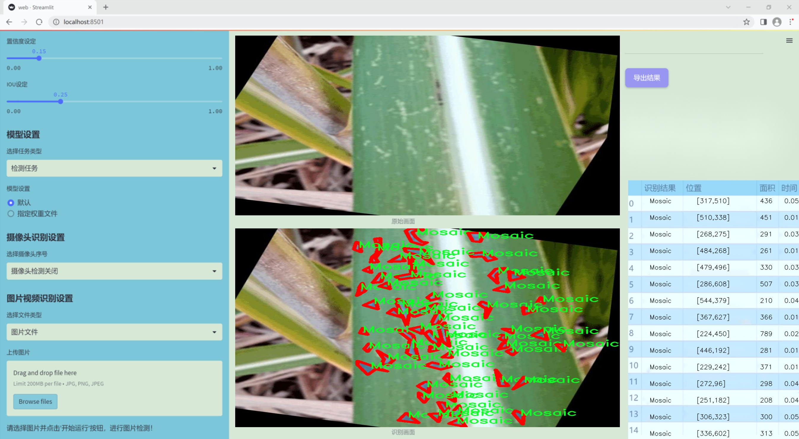
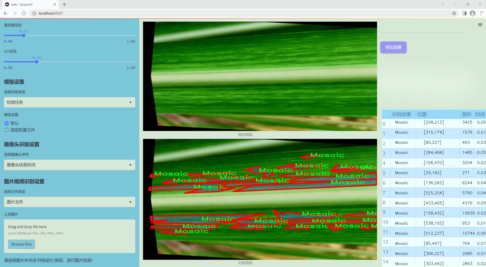
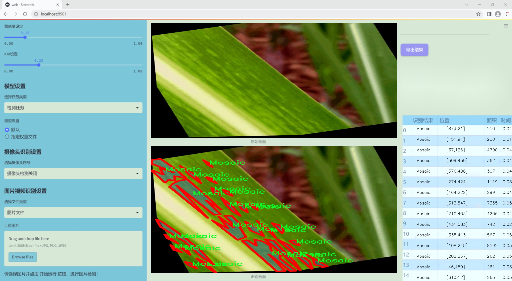
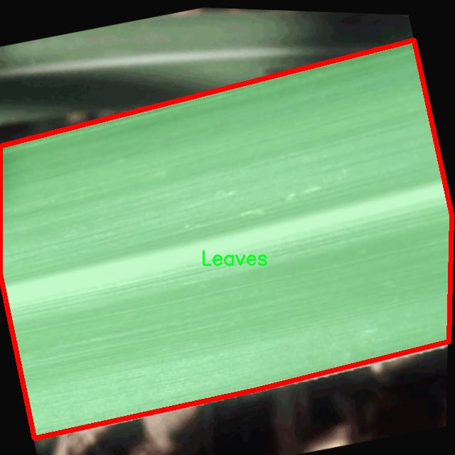
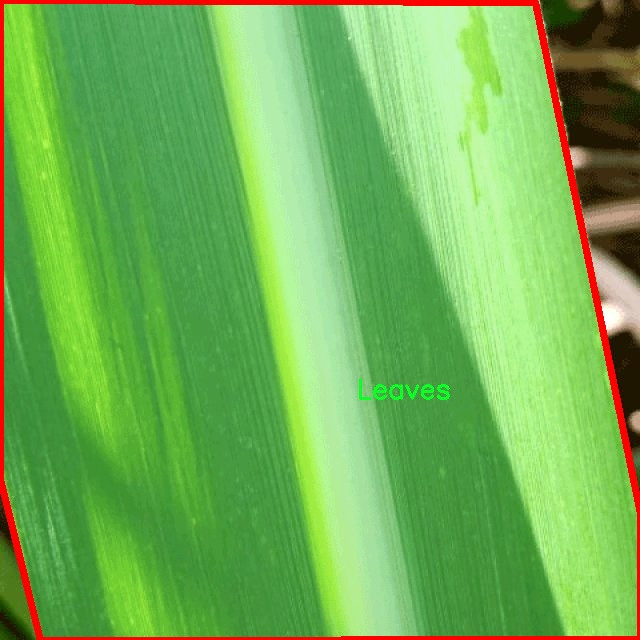
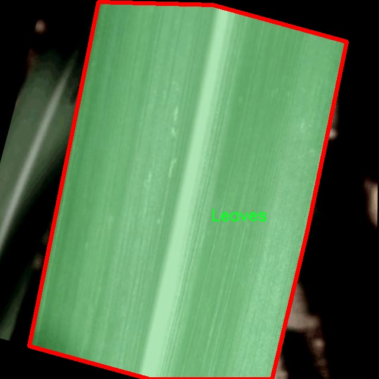
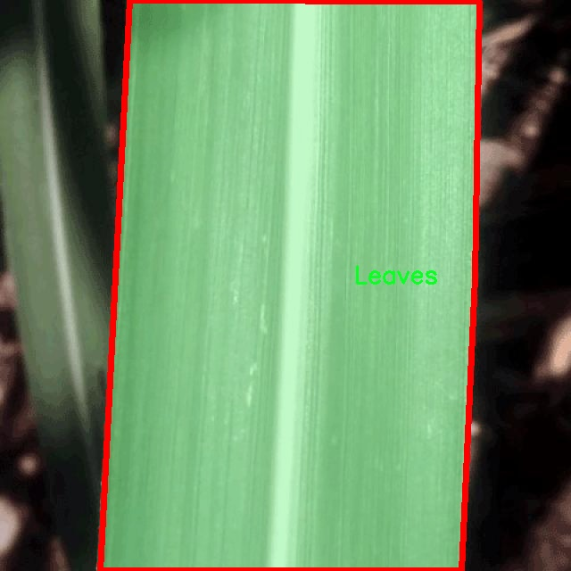
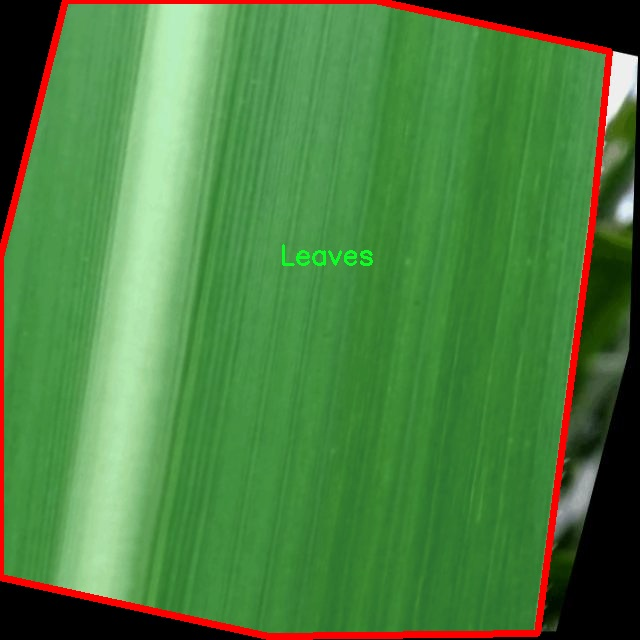

### 1.背景意义

研究背景与意义

甘蔗作为全球重要的经济作物之一，其产量和质量直接影响到糖业、酒业及生物能源等多个行业的发展。然而，甘蔗在生长过程中常常受到多种病害的侵袭，尤其是叶片病害，这不仅会导致产量下降，还会影响甘蔗的糖分含量和品质。因此，及时、准确地检测和识别甘蔗叶片病害，对于保障甘蔗的健康生长和提高经济效益具有重要意义。

近年来，随着计算机视觉技术的快速发展，基于深度学习的图像识别方法逐渐成为植物病害检测的主流手段。其中，YOLO（You Only Look Once）系列模型因其高效的实时检测能力而备受关注。YOLOv11作为该系列的最新版本，具有更强的特征提取能力和更高的检测精度，能够在复杂的环境中实现对甘蔗叶片病害的精准识别。通过对甘蔗叶片的图像进行实例分割，可以更好地理解病害的分布情况，为后续的防治措施提供科学依据。

本研究旨在基于改进的YOLOv11模型，构建一个高效的甘蔗叶片病害检测系统。我们将利用包含1400张图像的甘蔗叶片数据集，涵盖“叶片”、“马赛克”、“红腐病”和“锈病”四种类别，进行模型训练和评估。通过对数据集的精细标注和多样化的数据增强处理，提升模型的泛化能力和鲁棒性，力求在实际应用中实现高准确率和高召回率的检测效果。

此外，甘蔗叶片病害检测系统的建立，不仅可以为农民提供及时的病害预警，帮助其采取有效的防治措施，还能为农业管理部门提供数据支持，推动智能农业的发展。通过本研究，我们希望能够为甘蔗病害的早期检测和精准防治提供一种新思路，促进农业可持续发展，提升甘蔗产业的整体竞争力。

### 2.视频效果

[2.1 视频效果](https://www.bilibili.com/video/BV1yMkXYiEWq/)

### 3.图片效果







##### [项目涉及的源码数据来源链接](https://kdocs.cn/l/cszuIiCKVNis)**

注意：本项目提供训练的数据集和训练教程,由于版本持续更新,暂不提供权重文件（best.pt）,请按照6.训练教程进行训练后实现上图演示的效果。

### 4.数据集信息

##### 4.1 本项目数据集类别数＆类别名

nc: 4
names: ['Leaves', 'Mosaic', 'Red-Rot', 'Rust']


该项目为【图像分割】数据集，请在【训练教程和Web端加载模型教程（第三步）】这一步的时候按照【图像分割】部分的教程来训练

##### 4.2 本项目数据集信息介绍

本项目数据集信息介绍

本项目所使用的数据集专注于甘蔗叶片的病害检测，旨在通过改进YOLOv11模型，提高对甘蔗叶片病害的识别精度和效率。该数据集包含四个主要类别，分别为“Leaves”（健康叶片）、“Mosaic”（马赛克病）、“Red-Rot”（红腐病）和“Rust”（锈病）。这些类别涵盖了甘蔗叶片在生长过程中可能遭遇的主要病害，具有重要的农业应用价值。

在数据集的构建过程中，我们采集了大量的甘蔗叶片图像，确保每个类别的样本数量均衡且具有代表性。健康叶片的图像提供了一个基准，以便模型能够识别正常的生长状态。而马赛克病、红腐病和锈病的图像则展示了不同病害对叶片外观的影响，帮助模型学习到病害特征的多样性。这种多样化的样本不仅提高了模型的泛化能力，还能有效应对实际应用中可能遇到的各种变异情况。

此外，数据集中的图像经过精心标注，确保每个类别的特征清晰可辨。通过高质量的标注，模型在训练过程中能够准确学习到各类病害的视觉特征，从而在实际应用中实现高效的病害检测。数据集的设计考虑到了不同光照条件、角度和背景的变化，使得模型在面对复杂环境时依然能够保持较高的识别率。

综上所述，本项目的数据集不仅为甘蔗叶片病害检测提供了坚实的基础，也为后续的模型训练和优化奠定了良好的数据支持。通过利用这一数据集，我们期望能够显著提升甘蔗病害的自动检测能力，为农业生产提供更为精准的技术支持。











### 5.全套项目环境部署视频教程（零基础手把手教学）

[5.1 所需软件PyCharm和Anaconda安装教程（第一步）](https://www.bilibili.com/video/BV1BoC1YCEKi/?spm_id_from=333.999.0.0&vd_source=bc9aec86d164b67a7004b996143742dc)


[5.2 安装Python虚拟环境创建和依赖库安装视频教程（第二步）](https://www.bilibili.com/video/BV1ZoC1YCEBw?spm_id_from=333.788.videopod.sections&vd_source=bc9aec86d164b67a7004b996143742dc)

### 6.改进YOLOv11训练教程和Web_UI前端加载模型教程（零基础手把手教学）

[6.1 改进YOLOv11训练教程和Web_UI前端加载模型教程（第三步）](https://www.bilibili.com/video/BV1BoC1YCEhR?spm_id_from=333.788.videopod.sections&vd_source=bc9aec86d164b67a7004b996143742dc)


按照上面的训练视频教程链接加载项目提供的数据集，运行train.py即可开始训练



     Epoch   gpu_mem       box       obj       cls    labels  img_size
     1/200     20.8G   0.01576   0.01955  0.007536        22      1280: 100%|██████████| 849/849 [14:42<00:00,  1.04s/it]
               Class     Images     Labels          P          R     mAP@.5 mAP@.5:.95: 100%|██████████| 213/213 [01:14<00:00,  2.87it/s]
                 all       3395      17314      0.994      0.957      0.0957      0.0843

     Epoch   gpu_mem       box       obj       cls    labels  img_size
     2/200     20.8G   0.01578   0.01923  0.007006        22      1280: 100%|██████████| 849/849 [14:44<00:00,  1.04s/it]
               Class     Images     Labels          P          R     mAP@.5 mAP@.5:.95: 100%|██████████| 213/213 [01:12<00:00,  2.95it/s]
                 all       3395      17314      0.996      0.956      0.0957      0.0845

     Epoch   gpu_mem       box       obj       cls    labels  img_size
     3/200     20.8G   0.01561    0.0191  0.006895        27      1280: 100%|██████████| 849/849 [10:56<00:00,  1.29it/s]
               Class     Images     Labels          P          R     mAP@.5 mAP@.5:.95: 100%|███████   | 187/213 [00:52<00:00,  4.04it/s]
                 all       3395      17314      0.996      0.957      0.0957      0.0845


###### [项目数据集下载链接](https://kdocs.cn/l/cszuIiCKVNis)

### 7.原始YOLOv11算法讲解


##### YOLOv11三大损失函数

YOLOv11（You Only Look Once）是一种流行的目标检测算法，其损失函数设计用于同时优化分类和定位任务。YOLO的损失函数通常包括几个部分：
**分类损失、定位损失（边界框回归损失）和置信度损失** 。其中，

  1. box_loss（边界框回归损失）是用于优化预测边界框与真实边界框之间的差异的部分。

  2. cls_loss（分类损失）是用于优化模型对目标类别的预测准确性的部分。分类损失确保模型能够正确地识别出图像中的对象属于哪个类别。

  3. dfl_loss（Distribution Focal Loss）是YOLO系列中的一种损失函数，特别是在一些改进版本如YOLOv5和YOLOv7中被引入。它的主要目的是解决目标检测中的类别不平衡问题，并提高模型在处理小目标和困难样本时的性能。

##### 边界框回归损失详解

box_loss（边界框回归损失）是用于优化预测边界框与真实边界框之间的差异的部分。


##### box_loss 的具体意义


##### 为什么需要 box_loss

  * 精确定位：通过最小化中心点坐标损失和宽高损失，模型能够更准确地预测目标的位置和大小。
  * 平衡不同类型的目标：使用平方根来处理宽高损失，可以更好地平衡不同大小的目标，确保小目标也能得到足够的关注。
  * 稳定训练：适当的损失函数设计有助于模型的稳定训练，避免梯度爆炸或消失等问题。

##### 分类损失详解

在YOLO（You Only Look
Once）目标检测算法中，cls_loss（分类损失）是用于优化模型对目标类别的预测准确性的部分。分类损失确保模型能够正确地识别出图像中的对象属于哪个类别。下面是关于cls_loss的详细解读：

##### 分类损失 (cls_loss) 的具体意义

  
分类损失通常使用交叉熵损失（Cross-Entropy
Loss）来计算。交叉熵损失衡量的是模型预测的概率分布与真实标签之间的差异。在YOLO中，分类损失的具体形式如下：


##### 为什么需要 cls_loss

  * 类别识别：cls_loss 确保模型能够正确识别出图像中的目标属于哪个类别。这对于目标检测任务至关重要，因为不仅需要知道目标的位置，还需要知道目标的类型。

  * 多类别支持：通过最小化分类损失，模型可以处理多个类别的目标检测任务。例如，在道路缺陷检测中，可能需要识别裂缝、坑洞、路面破损等多种类型的缺陷。

  * 提高准确性：分类损失有助于提高模型的分类准确性，从而提升整体检测性能。通过优化分类损失，模型可以更好地学习不同类别之间的特征差异。

##### 分布损失详解

`dfl_loss`（Distribution Focal
Loss）是YOLO系列中的一种损失函数，特别是在一些改进版本如YOLOv5和YOLOv7中被引入。它的主要目的是解决目标检测中的类别不平衡问题，并提高模型在处理小目标和困难样本时的性能。下面是对`dfl_loss`的详细解读：

##### DFL Loss 的背景

在目标检测任务中，类别不平衡是一个常见的问题。某些类别的样本数量可能远远多于其他类别，这会导致模型在训练过程中对常见类别的学习效果较好，而对罕见类别的学习效果较差。此外，小目标和困难样本的检测也是一个挑战，因为这些目标通常具有较少的特征信息，容易被忽略或误分类。

为了应对这些问题，研究者们提出了多种改进方法，其中之一就是`dfl_loss`。`dfl_loss`通过引入分布焦点损失来增强模型对困难样本的关注，并改善类别不平衡问题。

##### DFL Loss 的定义

DFL Loss
通常与传统的交叉熵损失结合使用，以增强模型对困难样本的学习能力。其核心思想是通过对每个类别的预测概率进行加权，使得模型更加关注那些难以正确分类的样本。

DFL Loss 的公式可以表示为：


##### DFL Loss 的具体意义**

  * **类别不平衡：** 通过引入平衡因子 α，DFL Loss 可以更好地处理类别不平衡问题。对于少数类别的样本，可以通过增加其权重来提升其重要性，从而提高模型对这些类别的检测性能。
  *  **困难样本：** 通过聚焦参数 γ，DFL Loss 可以让模型更加关注那些难以正确分类的样本。当 
  * γ 较大时，模型会对那些预测概率较低的样本给予更多的关注，从而提高这些样本的分类准确性。
  *  **提高整体性能** ：DFL Loss 结合了传统交叉熵损失的优势，并通过加权机制增强了模型对困难样本的学习能力，从而提高了整体的检测性能。


### 8.200+种全套改进YOLOV11创新点原理讲解

#### 8.1 200+种全套改进YOLOV11创新点原理讲解大全

由于篇幅限制，每个创新点的具体原理讲解就不全部展开，具体见下列网址中的改进模块对应项目的技术原理博客网址【Blog】（创新点均为模块化搭建，原理适配YOLOv5~YOLOv11等各种版本）

[改进模块技术原理博客【Blog】网址链接](https://gitee.com/qunmasj/good)


#### 8.2 精选部分改进YOLOV11创新点原理讲解

###### 这里节选部分改进创新点展开原理讲解(完整的改进原理见上图和[改进模块技术原理博客链接](https://gitee.com/qunmasj/good)【如果此小节的图加载失败可以通过CSDN或者Github搜索该博客的标题访问原始博客，原始博客图片显示正常】



### Diverse Branch Block简介
参考该博客提出的一种通用的卷积网络构造块用来在不增加任何推理时间的前提下提升卷积网络的性能。我们将这个块命名为分离分支块（Diverse Branch Block）。通过结合不同尺寸和复杂度的分离分支（包括串联卷积、多尺度卷积和平均池化层）来增加特征空间的方法，它提升了单个卷积的表达能力。完成训练后，一个DBB(Diverse Branch Block)可以被等价地转换为一个单独的卷积操作以方便部署。不同于那些新颖的卷积结构的改进方式，DBB让训练时微结构复杂化同时维持大规模结构，因此我们可以将它作为任意结构中通用卷积层的一种嵌入式替代形式。通过这种方式，我们能够将模型训练到一个更高的表现水平，然后在推理时转换成原始推理时间的结构。

 
主要贡献点：

（1） 我们建议合并大量的微结构到不同的卷积结构中来提升性能，但是维持原始的宏观结构。

（2）我们提出DBB，一个通用构造块结构，概括六种转换来将一个DBB结构转化成一个单独卷积，因为对于用户来说它是无损的。

（3）我们提出一个Inception-like DBB结构实例(Fig 1)，并且展示它在ImageNet、COCO detection 和CityScapes任务中获得性能提升。


#### 结构重参数化
本文和一个并发网络RepVGG[1]是第一个使用结构重参数化来命名该思路------使用从其他结构转化来的参数确定当前结构的参数。一个之前的工作ACNet[2]也可以被划分为结构重参数化，它提出使用非对称卷积块来增强卷积核的结构（i.e 十字形结构）。相比于DBB，它被设计来提升卷积网络（在没有额外推理时间损失的条件下）。这个流水线也包含将一个训练好的模型转化为另一个。但是，ACNet和DBB的区别是：ACNet的思想被激发是基于一个观察，这个观察是网络结构的参数在过去有更大的量级，因此寻找方法让参数量级更大，然而我们关注一个不同的点。我们发现 平均池化、1x1 conv 和 1x1-kxk串联卷积是更有效的，因为它们提供了不同复杂度的路线，以及允许使用更多训练时非线性化。除此以外，ACB结构可以看作是DBB结构的一种特殊形式，因为那个1xk和kx1卷积层能够被扩大成kxk（via Transform VI(Fig.2)），然后合并成一个平方核（via Transform II）。

 

#### 分离分支结构
卷积的线性性
一个卷积操作可以表示为 ，其中为输入tensor, 为输出tensor。卷积核表示为一个四阶tensor , 偏置为。将加偏置的操作表示为。

因为，在第j个输出通道（h,w）位置的值可以由以下公式给出：，其中表示输入帧I的第c个通道上的一个滑动窗，对应输出帧O的坐标（h,w）。从上式可以看出，卷积操作具有齐次性和加法性。


注意：加法性成立的条件是两个卷积具有相同的配置（即通道数、核尺寸、步长和padding等）。

#### 分离分支的卷积
在这一小节，我们概括六种转换形式（Fig.2）来转换一个具有batch normalization(BN)、branch addition、depth concatenation、multi-scale operations、avarage pooling 和 sequences of convolutions的DBB分支。


Transform I：a conv for conv-BN  我们通常会给一个卷积配备配备一个BN层，它执行逐通道正则化和线性尺度放缩。设j为通道索引，分别为累积的逐通道均值和标准差，分别为学习的尺度因子和偏置项，对应输出通道j为


卷积的齐次性允许我们融合BN操作到前述的conv来做推理。在实践中，我们仅仅建立一个拥有卷积核和偏置, 用从原始BN序列的参数转换来的值来赋值。我们为每个输出通道j构造


Transform II a conv for branch addition  卷积的加法性确保如果有两个或者多个具有相同配置的卷积层相加，我们能够将它们合并到一个单独的卷积里面。对于conv-BN，我们应该首先执行Transform I。很明显的，通过下面的公式我们能够合并两个卷积


上述公式只有在两个卷积拥有相同配置时才成立。尽管合并上述分支能够在一定程度上增强模型，我们希望结合不同分支来进一步提升模型性能。在后面，我们介绍一些分支的形式，它们能够等价地被转化为一个单独的卷积。在通过多个转化来为每一个分支构造KxK的卷积之后，我们使用Transform II 将所有分支合并到一个conv里面。

Transform III: a conv for sequential convolutions   我们能够合并一个1x1 conv-BN-kxk conv序列到一个kxk conv里面。我们暂时假设卷积是稠密的（即 组数 groups=1）。组数groups>1的情形将会在Transform IV中实现。我们假定1x1和kxk卷积层的核形状分别是DxCx1x1和ExDxKxK，这里D指任意值。首先，我们将两个BN层融合到两个卷积层里面，由此获得。输出是


我们期望用一个单独卷积的核和偏置来表达，设, 它们满足。对方程（8）应用卷积的加法性，我们有


因为是一个1x1 conv，它只执行逐通道线性组合，没有空间聚合操作。通过线性重组KxK卷积核中的参数，我们能够将它合并到一个KxK的卷积核里面。容易证明的是，这样的转换可以由一个转置卷积实现：


其中是由转置获得的tensor张量。方程（10）的第二项是作用于常量矩阵上的卷积操作，因此它的输出也是一个常量矩阵。用表达式来说明，设是一个常数矩阵，其中的每个元素都等于p。*是一个2D 卷积操作，W为一个2D 卷积核。转换结果就是一个常量矩阵，这个常量矩阵是p 与 所有核元素之和 的乘积，即


基于以上观察，我们构造。然后，容易证明。

因此我们有

显而易见地，对于一个zero-pads 的KxK卷积，方程（8）并不成立，因为并不对的结果做卷积操作(如果有一个零元素的额外的圈，方程（8）成立)。解决方案有A)用padding配置第一个卷积，第二个卷积不用，B)通过做pad操作。后者的一个有效实现是定制第一个BN层，为了（1）如通常的batch-normalize输入。（2）计算(通过方程（6）)。（3）用  pad batch-normalized结果，例如 用一圈 pad 每一个通道j 。

Transform IV: a conv for depth concatenation  Inception 单元使用深度concatenation来组合不同分支。当每个分支都只包含一个相同配置的卷积时，深度concatenation等价于一个卷积，它的核在不同的输出通道上concatenation（比如我们公式中的第一个轴）假设。我们concatenate它们到。显然地


Transform IV 可以非常方便地将Transform III 扩展到 groupwise（即 groups > 1） 的情景。直觉上，一个groupwise 卷积将输入分割成g个并行的组，单独卷积它们，然后concatenate形成输出。为了代替g-group卷积，我们建立一个DBB结构，这个结构的所有卷积层有相同的组g。为了转换一个1x1-KxK序列，我们等价地分割它们成为g组，单独执行Transform III, 然后concatenate获得输出（如图Fig3所示）。


Transform V: a conv for average pooling  一个作用于C通道的核尺寸为K，步长为s的平均池化层等价于一个拥有相同核尺寸K,步长s的卷积层。这样的核可以被构造为

  


就像一个通常的平均池化操作，当s>1时执行降采样操作，当s=1时保持相同尺寸。

Transform VI: a conv for multi-scale convolutions   考虑一个等价于一个拥有相同zero padding的 核。特别地，卷积是格外实用的，因为它们能够有效实现。应该对输入作pad操作来对齐滑动窗。


### 9.系统功能展示

图9.1.系统支持检测结果表格显示

  图9.2.系统支持置信度和IOU阈值手动调节

  图9.3.系统支持自定义加载权重文件best.pt(需要你通过步骤5中训练获得)

  图9.4.系统支持摄像头实时识别

  图9.5.系统支持图片识别

  图9.6.系统支持视频识别

  图9.7.系统支持识别结果文件自动保存

  图9.8.系统支持Excel导出检测结果数据


### 10. YOLOv11核心改进源码讲解

#### 10.1 kan_conv.py

以下是经过简化和注释的核心代码，保留了最重要的部分，并对每个部分进行了详细的中文注释：

```python
import torch
import torch.nn as nn

class KANConvNDLayer(nn.Module):
    def __init__(self, conv_class, norm_class, input_dim, output_dim, spline_order, kernel_size,
                 groups=1, padding=0, stride=1, dilation=1,
                 ndim: int = 2, grid_size=5, base_activation=nn.GELU, grid_range=[-1, 1], dropout=0.0):
        super(KANConvNDLayer, self).__init__()
        
        # 初始化参数
        self.inputdim = input_dim  # 输入维度
        self.outdim = output_dim    # 输出维度
        self.spline_order = spline_order  # 样条的阶数
        self.kernel_size = kernel_size  # 卷积核大小
        self.padding = padding  # 填充
        self.stride = stride  # 步幅
        self.dilation = dilation  # 膨胀
        self.groups = groups  # 分组数
        self.ndim = ndim  # 维度
        self.grid_size = grid_size  # 网格大小
        self.base_activation = base_activation()  # 基础激活函数
        self.grid_range = grid_range  # 网格范围

        # 初始化dropout层
        self.dropout = nn.Dropout2d(p=dropout) if ndim == 2 else nn.Dropout3d(p=dropout) if ndim == 3 else nn.Dropout1d(p=dropout) if ndim == 1 else None

        # 检查分组参数
        if groups <= 0 or input_dim % groups != 0 or output_dim % groups != 0:
            raise ValueError('groups must be a positive integer and input/output dimensions must be divisible by groups')

        # 初始化基础卷积层
        self.base_conv = nn.ModuleList([conv_class(input_dim // groups, output_dim // groups, kernel_size, stride, padding, dilation, groups=1, bias=False) for _ in range(groups)])

        # 初始化样条卷积层
        self.spline_conv = nn.ModuleList([conv_class((grid_size + spline_order) * input_dim // groups, output_dim // groups, kernel_size, stride, padding, dilation, groups=1, bias=False) for _ in range(groups)])

        # 初始化归一化层
        self.layer_norm = nn.ModuleList([norm_class(output_dim // groups) for _ in range(groups)])

        # 初始化PReLU激活函数
        self.prelus = nn.ModuleList([nn.PReLU() for _ in range(groups)])

        # 创建网格
        h = (self.grid_range[1] - self.grid_range[0]) / grid_size
        self.grid = torch.linspace(self.grid_range[0] - h * spline_order, self.grid_range[1] + h * spline_order, grid_size + 2 * spline_order + 1, dtype=torch.float32)

        # 初始化卷积层权重
        for conv_layer in self.base_conv:
            nn.init.kaiming_uniform_(conv_layer.weight, nonlinearity='linear')
        for conv_layer in self.spline_conv:
            nn.init.kaiming_uniform_(conv_layer.weight, nonlinearity='linear')

    def forward_kan(self, x, group_index):
        # 基础卷积层的前向传播
        base_output = self.base_conv[group_index](self.base_activation(x))

        # 计算样条基
        x_uns = x.unsqueeze(-1)  # 扩展维度
        target = x.shape[1:] + self.grid.shape
        grid = self.grid.view(*list([1 for _ in range(self.ndim + 1)] + [-1, ])).expand(target).contiguous().to(x.device)

        # 计算样条基
        bases = ((x_uns >= grid[..., :-1]) & (x_uns < grid[..., 1:])).to(x.dtype)
        for k in range(1, self.spline_order + 1):
            left_intervals = grid[..., :-(k + 1)]
            right_intervals = grid[..., k:-1]
            delta = torch.where(right_intervals == left_intervals, torch.ones_like(right_intervals), right_intervals - left_intervals)
            bases = ((x_uns - left_intervals) / delta * bases[..., :-1]) + ((grid[..., k + 1:] - x_uns) / (grid[..., k + 1:] - grid[..., 1:(-k)]) * bases[..., 1:])
        bases = bases.contiguous().moveaxis(-1, 2).flatten(1, 2)

        # 通过样条卷积层计算输出
        spline_output = self.spline_conv[group_index](bases)
        x = self.prelus[group_index](self.layer_norm[group_index](base_output + spline_output))

        # 应用dropout
        if self.dropout is not None:
            x = self.dropout(x)

        return x

    def forward(self, x):
        # 分组输入并进行前向传播
        split_x = torch.split(x, self.inputdim // self.groups, dim=1)
        output = []
        for group_ind, _x in enumerate(split_x):
            y = self.forward_kan(_x.clone(), group_ind)
            output.append(y.clone())
        y = torch.cat(output, dim=1)  # 合并输出
        return y

# 1D、2D、3D卷积层的子类
class KANConv3DLayer(KANConvNDLayer):
    def __init__(self, input_dim, output_dim, kernel_size, spline_order=3, groups=1, padding=0, stride=1, dilation=1,
                 grid_size=5, base_activation=nn.GELU, grid_range=[-1, 1], dropout=0.0):
        super(KANConv3DLayer, self).__init__(nn.Conv3d, nn.InstanceNorm3d,
                                             input_dim, output_dim,
                                             spline_order, kernel_size,
                                             groups=groups, padding=padding, stride=stride, dilation=dilation,
                                             ndim=3,
                                             grid_size=grid_size, base_activation=base_activation,
                                             grid_range=grid_range, dropout=dropout)

class KANConv2DLayer(KANConvNDLayer):
    def __init__(self, input_dim, output_dim, kernel_size, spline_order=3, groups=1, padding=0, stride=1, dilation=1,
                 grid_size=5, base_activation=nn.GELU, grid_range=[-1, 1], dropout=0.0):
        super(KANConv2DLayer, self).__init__(nn.Conv2d, nn.InstanceNorm2d,
                                             input_dim, output_dim,
                                             spline_order, kernel_size,
                                             groups=groups, padding=padding, stride=stride, dilation=dilation,
                                             ndim=2,
                                             grid_size=grid_size, base_activation=base_activation,
                                             grid_range=grid_range, dropout=dropout)

class KANConv1DLayer(KANConvNDLayer):
    def __init__(self, input_dim, output_dim, kernel_size, spline_order=3, groups=1, padding=0, stride=1, dilation=1,
                 grid_size=5, base_activation=nn.GELU, grid_range=[-1, 1], dropout=0.0):
        super(KANConv1DLayer, self).__init__(nn.Conv1d, nn.InstanceNorm1d,
                                             input_dim, output_dim,
                                             spline_order, kernel_size,
                                             groups=groups, padding=padding, stride=stride, dilation=dilation,
                                             ndim=1,
                                             grid_size=grid_size, base_activation=base_activation,
                                             grid_range=grid_range, dropout=dropout)
```

### 代码说明
1. **KANConvNDLayer**: 这是一个通用的N维卷积层，支持不同维度的卷积操作（1D、2D、3D），并实现了样条卷积的功能。
2. **初始化方法**: 在初始化中设置了卷积层、归一化层、激活函数等，并进行了参数的有效性检查。
3. **前向传播**: `forward_kan`方法实现了基础卷积和样条卷积的前向传播，计算样条基并通过卷积层得到输出。
4. **子类**: `KANConv1DLayer`、`KANConv2DLayer`和`KANConv3DLayer`分别是1D、2D和3D卷积层的实现，继承自`KANConvNDLayer`。

这个文件定义了一个名为 `KANConvNDLayer` 的神经网络层，它是一个通用的卷积层，支持多维卷积（1D、2D、3D），并结合了样条基函数（spline basis）来增强特征提取能力。这个层的设计旨在通过自定义的卷积操作和归一化方法来提升模型的表现。

在 `KANConvNDLayer` 的构造函数中，首先初始化了一些基本参数，包括输入和输出维度、卷积核大小、样条阶数、分组数、填充、步幅、扩张、网格大小、激活函数、网格范围以及 dropout 概率。构造函数中还会进行一些有效性检查，比如确保分组数为正整数，并且输入和输出维度能够被分组数整除。

接下来，`KANConvNDLayer` 创建了基础卷积层和样条卷积层的模块列表。基础卷积层使用指定的卷积类（如 `nn.Conv1d`、`nn.Conv2d` 或 `nn.Conv3d`）进行初始化，而样条卷积层则通过增加样条阶数来扩展输入维度。每个卷积层后面跟随一个归一化层和一个 PReLU 激活函数。

网格的生成是通过 `torch.linspace` 函数创建的，网格的范围和大小由用户指定。权重初始化使用 Kaiming 均匀分布，以帮助模型在训练初期更快收敛。

在 `forward_kan` 方法中，首先对输入进行基础激活，然后通过基础卷积层进行线性变换。接着，计算样条基函数，基于输入值和网格值生成样条基。通过循环计算样条基的多个阶数，最终将这些基传递给样条卷积层。最后，通过归一化和激活函数处理输出，并在需要时应用 dropout。

`forward` 方法则是将输入张量按组分割，然后对每个组调用 `forward_kan` 方法，最后将所有组的输出拼接在一起。

此外，文件中还定义了三个子类 `KANConv1DLayer`、`KANConv2DLayer` 和 `KANConv3DLayer`，分别用于一维、二维和三维卷积。这些子类通过调用父类的构造函数，传入相应的卷积类和归一化类，简化了多维卷积层的创建过程。

总的来说，这个文件实现了一个灵活且功能强大的卷积层，能够处理多维数据并结合样条基函数，适用于需要复杂特征提取的深度学习任务。

#### 10.2 transformer.py

以下是经过简化和注释的核心代码部分：

```python
import torch
import torch.nn as nn
from functools import partial

# 导入自定义的归一化模块
from .prepbn import RepBN, LinearNorm
from ..modules.transformer import TransformerEncoderLayer

# 定义可用的模块
__all__ = ['AIFI_RepBN']

# 定义线性归一化的部分应用
ln = nn.LayerNorm
linearnorm = partial(LinearNorm, norm1=ln, norm2=RepBN, step=60000)

class TransformerEncoderLayer_RepBN(TransformerEncoderLayer):
    def __init__(self, c1, cm=2048, num_heads=8, dropout=0, act=..., normalize_before=False):
        # 初始化父类
        super().__init__(c1, cm, num_heads, dropout, act, normalize_before)
        
        # 使用自定义的归一化方法
        self.norm1 = linearnorm(c1)
        self.norm2 = linearnorm(c1)

class AIFI_RepBN(TransformerEncoderLayer_RepBN):
    """定义AIFI变换器层。"""

    def __init__(self, c1, cm=2048, num_heads=8, dropout=0, act=nn.GELU(), normalize_before=False):
        """使用指定参数初始化AIFI实例。"""
        super().__init__(c1, cm, num_heads, dropout, act, normalize_before)

    def forward(self, x):
        """AIFI变换器层的前向传播。"""
        c, h, w = x.shape[1:]  # 获取输入的通道数、高度和宽度
        pos_embed = self.build_2d_sincos_position_embedding(w, h, c)  # 构建位置嵌入
        # 将输入张量从形状[B, C, H, W]展平为[B, HxW, C]
        x = super().forward(x.flatten(2).permute(0, 2, 1), pos=pos_embed.to(device=x.device, dtype=x.dtype))
        # 将输出张量的形状转换回[B, C, H, W]
        return x.permute(0, 2, 1).view([-1, c, h, w]).contiguous()

    @staticmethod
    def build_2d_sincos_position_embedding(w, h, embed_dim=256, temperature=10000.0):
        """构建2D正弦-余弦位置嵌入。"""
        assert embed_dim % 4 == 0, "嵌入维度必须是4的倍数，以便进行2D正弦-余弦位置嵌入"
        # 创建宽度和高度的网格
        grid_w = torch.arange(w, dtype=torch.float32)
        grid_h = torch.arange(h, dtype=torch.float32)
        grid_w, grid_h = torch.meshgrid(grid_w, grid_h, indexing="ij")
        
        pos_dim = embed_dim // 4  # 计算位置维度
        omega = torch.arange(pos_dim, dtype=torch.float32) / pos_dim
        omega = 1.0 / (temperature**omega)  # 温度缩放

        # 计算位置嵌入
        out_w = grid_w.flatten()[..., None] @ omega[None]
        out_h = grid_h.flatten()[..., None] @ omega[None]

        # 返回拼接的正弦和余弦嵌入
        return torch.cat([torch.sin(out_w), torch.cos(out_w), torch.sin(out_h), torch.cos(out_h)], 1)[None]
```

### 代码说明：
1. **导入模块**：导入了必要的PyTorch模块和自定义的归一化模块。
2. **归一化设置**：使用`partial`函数定义了线性归一化和自定义的RepBN归一化的组合。
3. **TransformerEncoderLayer_RepBN类**：继承自`TransformerEncoderLayer`，初始化时设置了两个归一化层。
4. **AIFI_RepBN类**：继承自`TransformerEncoderLayer_RepBN`，实现了AIFI变换器层的初始化和前向传播。
5. **前向传播**：在`forward`方法中，输入张量被展平并传递给父类的前向方法，同时生成并使用位置嵌入。
6. **位置嵌入构建**：`build_2d_sincos_position_embedding`静态方法生成2D正弦-余弦位置嵌入，确保嵌入维度是4的倍数，并使用温度缩放。

这个程序文件 `transformer.py` 定义了一个基于 Transformer 架构的模型，主要包含了 AIFI（Attention with Information Flow Injection）层的实现，并使用了改进的归一化方法（RepBN）。以下是对代码的详细讲解。

首先，文件导入了必要的 PyTorch 库和模块，包括 `torch`、`torch.nn` 和 `torch.nn.functional`，这些都是构建神经网络所需的基础组件。此外，还导入了 `RepBN` 和 `LinearNorm` 这两个自定义的归一化模块，以及 `TransformerEncoderLayer` 和 `AIFI` 模块。

接下来，定义了一个名为 `linearnorm` 的部分函数，它是 `LinearNorm` 的一个实例，使用了 `LayerNorm` 和 `RepBN` 作为归一化方法，并设定了一个步数参数为 60000。这一设置为后续的模型层提供了灵活的归一化选项。

然后，定义了 `TransformerEncoderLayer_RepBN` 类，它继承自 `TransformerEncoderLayer`。在初始化方法中，调用了父类的构造函数，并定义了两个归一化层 `norm1` 和 `norm2`，它们都是使用 `linearnorm` 创建的。这使得该层在前向传播时可以使用改进的归一化策略。

接着，定义了 `AIFI_RepBN` 类，它继承自 `TransformerEncoderLayer_RepBN`，并且是 AIFI transformer 层的具体实现。在初始化方法中，除了调用父类的构造函数外，还可以指定激活函数（默认为 GELU），以及其他参数。

在 `forward` 方法中，首先获取输入张量 `x` 的形状信息（通道数 `c`、高度 `h` 和宽度 `w`）。然后，调用 `build_2d_sincos_position_embedding` 方法生成二维的正弦余弦位置嵌入，这对于处理图像数据时保持空间信息是非常重要的。接下来，将输入张量 `x` 进行展平和维度变换，以适应 Transformer 的输入格式。最后，调用父类的 `forward` 方法进行前向传播，并将输出结果重新排列为原始的形状。

`build_2d_sincos_position_embedding` 是一个静态方法，用于构建二维的正弦余弦位置嵌入。该方法首先检查嵌入维度是否能被 4 整除，这是为了满足正弦余弦嵌入的要求。然后，通过生成网格坐标并计算对应的正弦和余弦值，返回一个包含位置嵌入的张量。

总的来说，这个文件实现了一个基于 Transformer 的编码层，结合了 AIFI 的注意力机制和改进的归一化方法，适用于处理图像等高维数据。

#### 10.3 block.py

以下是代码中最核心的部分，并附上详细的中文注释：

```python
import torch
import torch.nn as nn
import torch.nn.functional as F

def autopad(k, p=None, d=1):  # kernel, padding, dilation
    """自动填充以保持输出形状不变。"""
    if d > 1:
        k = d * (k - 1) + 1 if isinstance(k, int) else [d * (x - 1) + 1 for x in k]  # 实际的卷积核大小
    if p is None:
        p = k // 2 if isinstance(k, int) else [x // 2 for x in k]  # 自动填充
    return p

class Conv(nn.Module):
    """定义卷积层，包含卷积、批归一化和激活函数。"""
    def __init__(self, in_channels, out_channels, kernel_size=3, stride=1, padding=None, groups=1, act=True):
        super().__init__()
        self.conv = nn.Conv2d(in_channels, out_channels, kernel_size, stride, autopad(kernel_size, padding), groups=groups, bias=False)
        self.bn = nn.BatchNorm2d(out_channels)
        self.act = nn.SiLU() if act else nn.Identity()  # 使用SiLU激活函数

    def forward(self, x):
        """前向传播。"""
        return self.act(self.bn(self.conv(x)))

class Bottleneck(nn.Module):
    """标准瓶颈模块，包含两个卷积层。"""
    def __init__(self, c1, c2, shortcut=True, g=1, k=(3, 3), e=0.5):
        super().__init__()
        c_ = int(c2 * e)  # 隐藏通道数
        self.cv1 = Conv(c1, c_, k[0], 1)  # 第一个卷积层
        self.cv2 = Conv(c_, c2, k[1], 1, g=g)  # 第二个卷积层
        self.add = shortcut and c1 == c2  # 是否使用快捷连接

    def forward(self, x):
        """前向传播。"""
        return x + self.cv2(self.cv1(x)) if self.add else self.cv2(self.cv1(x))

class C3k(nn.Module):
    """C3k模块，包含多个瓶颈模块。"""
    def __init__(self, c1, c2, n=1, shortcut=False, g=1, e=0.5, k=3):
        super().__init__()
        self.m = nn.Sequential(*(Bottleneck(c1, c2, shortcut, g, k=(k, k), e=e) for _ in range(n)))  # 创建n个瓶颈模块

    def forward(self, x):
        """前向传播。"""
        return self.m(x)

class C3k2(nn.Module):
    """C3k2模块，包含多个C3k模块。"""
    def __init__(self, c1, c2, n=1, c3k=False, e=0.5, g=1, shortcut=True):
        super().__init__()
        self.m = nn.ModuleList(C3k(c1, c2, n, shortcut, g, e) for _ in range(n))  # 创建n个C3k模块

    def forward(self, x):
        """前向传播。"""
        for m in self.m:
            x = m(x)  # 依次通过每个模块
        return x

class FocusFeature(nn.Module):
    """特征聚焦模块，结合了不同特征图的上下文信息。"""
    def __init__(self, inc, kernel_sizes=(3, 5, 7, 9, 11), e=0.5):
        super().__init__()
        hidc = int(inc[1] * e)  # 隐藏通道数
        
        self.conv1 = Conv(inc[0], hidc, 1, 1)  # 1x1卷积
        self.conv2 = Conv(inc[1], hidc, 1)  # 1x1卷积
        self.conv3 = ADown(inc[2], hidc)  # 下采样卷积
        
        self.dw_conv = nn.ModuleList(nn.Conv2d(hidc * 3, hidc * 3, kernel_size=k, padding=autopad(k), groups=hidc * 3) for k in kernel_sizes)  # 多尺度卷积
        self.pw_conv = Conv(hidc * 3, hidc * 3)  # 1x1卷积
    
    def forward(self, x):
        """前向传播。"""
        x1, x2, x3 = x  # 分别获取三个输入特征图
        x1 = self.conv1(x1)  # 处理第一个特征图
        x2 = self.conv2(x2)  # 处理第二个特征图
        x3 = self.conv3(x3)  # 处理第三个特征图
        
        x = torch.cat([x1, x2, x3], dim=1)  # 连接三个特征图
        feature = torch.sum(torch.stack([x] + [layer(x) for layer in self.dw_conv], dim=0), dim=0)  # 多尺度卷积
        feature = self.pw_conv(feature)  # 1x1卷积
        
        x = x + feature  # 残差连接
        return x  # 返回结果

# 以上是核心部分的代码和详细注释，涵盖了网络结构、模块功能及其前向传播过程。
```

以上代码片段展示了深度学习模型中的一些核心模块，包括卷积层、瓶颈模块、特征聚焦模块等。每个模块都有其特定的功能和结构，通过注释详细解释了每个部分的作用和前向传播的过程。

这个程序文件 `block.py` 定义了一系列用于深度学习模型的模块，主要集中在卷积神经网络（CNN）和注意力机制的实现上。以下是对文件中主要内容的说明：

首先，文件引入了多个必要的库，包括 `torch` 和 `torch.nn`，以及一些自定义的模块和函数。这些库和模块为后续的网络结构提供了基础。

文件中定义了多个类，主要分为以下几类：

1. **卷积和注意力模块**：文件中定义了多种卷积层（如 `Conv`、`DWConv`、`DSConv` 等），这些卷积层可能包含不同的激活函数和归一化层。注意力机制的实现也有多种，如 `GOLDYOLO_Attention`、`SMA`、`PSA` 等，利用这些机制可以增强模型对特征的关注能力。

2. **基础模块**：如 `Bottleneck`、`C3k` 和 `C3k2` 等，这些模块通常是构建更复杂网络的基础单元。它们实现了基本的卷积操作和残差连接，常用于构建深层网络。

3. **特定结构的模块**：如 `CSPStage`、`C3k_Faster`、`C3k2_Faster` 等，这些模块实现了特定的网络结构，可能结合了不同的卷积层和注意力机制，以实现更好的特征提取和融合。

4. **自适应和动态模块**：如 `DynamicConv`、`DynamicInterpolationFusion` 等，这些模块允许在运行时根据输入的特征动态调整卷积操作的参数，增强了模型的灵活性。

5. **融合模块**：如 `Fusion`、`AdvPoolFusion`、`DynamicAlignFusion` 等，这些模块用于将来自不同来源的特征进行融合，以提高模型的表现。

6. **上采样和下采样模块**：如 `WaveletPool`、`WaveletUnPool`、`V7DownSampling` 等，这些模块实现了特征图的上采样和下采样操作，常用于构建特征金字塔网络（FPN）。

7. **其他模块**：文件中还定义了一些其他的模块，如 `SEAM`、`SDFM`、`CSP_PTB` 等，这些模块结合了不同的特征处理方法，旨在提高模型的性能。

整体而言，`block.py` 文件构建了一个复杂的深度学习模型框架，包含了多种卷积、注意力机制和特征融合的实现，适用于图像处理、目标检测等任务。每个模块都可以单独使用或组合使用，以构建出不同的网络结构。

#### 10.4 ui.py

```python
import sys
import subprocess

def run_script(script_path):
    """
    使用当前 Python 环境运行指定的脚本。

    Args:
        script_path (str): 要运行的脚本路径

    Returns:
        None
    """
    # 获取当前 Python 解释器的路径
    python_path = sys.executable

    # 构建运行命令，使用 streamlit 运行指定的脚本
    command = f'"{python_path}" -m streamlit run "{script_path}"'

    # 执行命令，并等待其完成
    result = subprocess.run(command, shell=True)
    
    # 检查命令执行的返回码，如果不为0，表示出错
    if result.returncode != 0:
        print("脚本运行出错。")


# 实例化并运行应用
if __name__ == "__main__":
    # 指定要运行的脚本路径
    script_path = "web.py"  # 假设脚本在当前目录下

    # 调用函数运行脚本
    run_script(script_path)
```

### 代码核心部分及注释说明：

1. **导入模块**：
   - `import sys`：用于访问与 Python 解释器相关的变量和函数。
   - `import subprocess`：用于执行外部命令和管理子进程。

2. **定义 `run_script` 函数**：
   - 该函数接受一个参数 `script_path`，表示要运行的 Python 脚本的路径。
   - 函数内部首先获取当前 Python 解释器的路径，以便后续执行脚本。

3. **构建命令**：
   - 使用 `streamlit` 模块运行指定的脚本，构建命令字符串。

4. **执行命令**：
   - 使用 `subprocess.run` 方法执行构建的命令，并等待其完成。
   - 通过检查 `result.returncode` 来判断命令是否成功执行，返回码为0表示成功，其他值表示出错。

5. **主程序入口**：
   - 在 `if __name__ == "__main__":` 块中，指定要运行的脚本路径，并调用 `run_script` 函数来执行该脚本。

这个程序文件名为 `ui.py`，主要功能是通过当前的 Python 环境运行一个指定的脚本，具体是一个名为 `web.py` 的文件。程序首先导入了必要的模块，包括 `sys`、`os` 和 `subprocess`，这些模块分别用于获取系统信息、处理文件路径和执行外部命令。

在文件中定义了一个名为 `run_script` 的函数，该函数接受一个参数 `script_path`，表示要运行的脚本的路径。函数内部首先获取当前 Python 解释器的路径，使用 `sys.executable` 可以得到当前 Python 环境的完整路径。接着，构建一个命令字符串，命令格式为 `python -m streamlit run script_path`，其中 `streamlit` 是一个用于构建和共享数据应用的库。

然后，使用 `subprocess.run` 方法执行这个命令。`shell=True` 参数表示在一个新的 shell 中执行命令。执行完命令后，程序检查返回码 `result.returncode`，如果返回码不为 0，说明脚本运行过程中出现了错误，此时会打印出一条错误信息。

在文件的最后部分，使用 `if __name__ == "__main__":` 语句来确保当这个文件作为主程序运行时，才会执行下面的代码。这里指定了要运行的脚本路径为 `web.py`，并调用 `run_script` 函数来执行这个脚本。

整体来看，这个程序的主要作用是提供一个简单的接口，通过命令行来运行一个 Streamlit 应用，方便用户在当前 Python 环境中启动指定的应用脚本。

### 11.完整训练+Web前端界面+200+种全套创新点源码、数据集获取


# [下载链接：https://mbd.pub/o/bread/Z52TkpZw](https://mbd.pub/o/bread/Z52TkpZw)